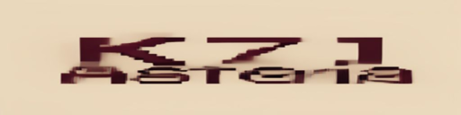

<p align="center">
  
</p>

<p align="center">
  <strong>a personal operating system for memories</strong>
</p>

<p align="center">
  
</p>

---

## what is K7I Asteria?

K7I Asteria is a **local-first, retro desktop application** that treats your life like a filesystem.

Instead of a modern SaaS dashboard, you get a classic operating system interface – beige windows, a pixel desktop, draggable panels, and a menubar – where everything is a **memory file**:

- Books become files
- Movies become files
- Trips become folders
- Photos become assets
- Journals become documents
- Workouts become logs
- Places become nodes

> *"This is not an app. This is my own personal computer for my life."*

## technology

| layer | stack |
|-------|-------|
| desktop shell | **Tauri v2** (Rust + WebView) |
| backend | **Rust**, SQLx, SQLite, WAL mode |
| frontend | **React 18**, TypeScript, Vite |
| UI | Tailwind CSS, Framer Motion, Zustand |
| window system | custom retro OS emulation |
| AI | provider-agnostic (Ollama / OpenAI / Anthropic / local heuristics) |

### architecture

K7I Asteria follows clean architecture:

```
src-tauri/
├── src/
│   ├── domain/       # pure aggregates (Memory, Link, MemoryKind)
│   ├── storage/      # SQLite repository + migrations
│   ├── services/     # use-cases (search, stats)
│   ├── importers/    # plugin-based (csv, json, sample)
│   ├── ai/           # provider-agnostic AI hub
│   ├── commands/     # Tauri command surface
│   └── lib.rs        # dependency injection + app bootstrap
src/
├── stores/           # Zustand (window manager, memory store)
├── desktop/          # WindowFrame, Menubar, SystemTray, icons
├── windows/          # Memory, Folder, Timeline, Stats, Import, Settings, AI
├── memory/ipc.ts     # typed Tauri invoke wrappers
├── types.ts          # shared frontend types
└── App.tsx
```

## quick start

```bash
# requirements: Rust 1.77+, Node 20+, Tauri system deps (see below)
git clone https://github.com/K7Int/k7iasteria.git
cd k7iasteria

# install frontend deps
npm install

# run in development mode
cargo tauri dev
```

### system dependencies

**Linux (Debian/Ubuntu)**:
```bash
sudo apt-get install \
  libwebkit2gtk-4.1-dev \
  libjavascriptcoregtk-4.1-dev \
  libgtk-3-dev \
  libayatana-appindicator3-dev \
  librsvg2-dev \
  patchelf \
  libsoup-3.0-dev
```

**macOS**: Xcode Command Line Tools (`xcode-select --install`)

**Windows**: Visual Studio 2022 Build Tools (or VS 2022 with "Desktop development with C++")

## build for production

```bash
cargo tauri build
```

Artifacts land in `src-tauri/target/release/bundle/`.

## the desktop

When you open K7I Asteria you are greeted by a **desktop workspace**:

- **Desktop icons** – floating memory folders (Books, Trips, Journals …)
- **Menubar** – Apple menu, File, View, Search (drop-downs like Mac OS 9)
- **System tray** – clock, settings gear
- **Windows** – memory files open in draggable, resizable, overlapping panels with classic titlebar controls (⊗ ▢ ⤢)
- **Search palette** – `⌘K` opens a system-wide search box (filename, content, tags, kind filters)
- **Recent dock** – a strip at the bottom-left showing recently edited memories

### window types

| kind | purpose |
|------|---------|
| Memory | view / edit a single memory (title, kind, content, tags, metadata, links) |
| Folder | browse children in a grid, create new inline |
| Timeline | expandable year-by-year file explorer |
| System Info | classic OS system monitor – totals by kind, yearly activity bar chart |
| Import | CSV / JSON / sample data importer with file dialog |
| Settings | AI provider configuration (Ollama, OpenAI, …) |
| AI | offline summarizer, tag suggester, life-insight |

## the memory system

Every memory is a file-like object:

```json
{
  "id": "uuid",
  "parent_id": null | "uuid",
  "title": "Iceland 2022",
  "kind": "folder" | "file" | "document" | "log" | "photo" | "link" | "place" | "dataset",
  "content": "free text or structured body",
  "metadata": { "author": "...", "year": 2022, ... },
  "tags": ["iceland", "travel"],
  "occurred_at": "2022-06-15T…",
}
```

Memories link to each other like a graph filesystem.

## search

The search command (`⌘K`) queries title, content, and tags across the whole store. You can filter by kind. Examples:

```
trips with books
iceland
journal mentioning Berlin
photos from 2022
```

## importing data

Built-in importers:
- **CSV** – any CSV with a header row (title column auto-detected)
- **JSON** – array or single memory object
- **Sample data** – restores the starter folders

Importers are plugin-based – adding a new format means writing a one-file Rust `impl Importer` trait.

Third-party plugin placeholders listed in the UI:
Goodreads, Letterboxd, Spotify, Strava, Apple Health, Google Takeout, Photos, Bookmarks.

## AI layer

The AI hub works **fully offline** out of the box with built-in heuristics (keyword extraction, tag suggestion, life-insight).

You can connect a provider in Settings:

| provider | setup |
|----------|-------|
| Ollama (local) | set host + model (default: `http://localhost:11434` + `llama3.1`) |
| OpenAI | set API key + model |
| Anthropic | set API key + model |
| Custom | any OpenAI-compatible endpoint (e.g. vLLM, Groq, …) |

## project structure

```
k7iasteria/
├── .github/workflows/
│   ├── ci.yml           # lint + build on every push (Windows / macOS / Linux)
│   └── release.yml      # triggered on v* tags → draft release with installers
├── src/                 # React / TypeScript frontend
├── src-tauri/           # Rust / Tauri backend
│   ├── migrations/      # SQLite migrations (0001_init.sql)
│   ├── icons/           # app icons (ico, icns, png)
│   └── src/             # Rust source (domain, storage, services, commands, ai, importers)
├── assets/
│   ├── logo/            # wordmark, asteria mark
│   └── images/          # wallpaper, empty-state illustration
└── package.json
```

## release workflow

Push a version tag to trigger the release pipeline:

```bash
git tag v1.0.0
git push origin v1.0.0
```

The release workflow builds installers for all platforms and creates a **draft** GitHub Release. Review and publish manually.

## license

MIT
